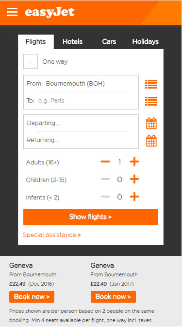

# Comparing-Three-Different-Reponsive-Websites

A brief comparison of three different responsive websites

**Website 1: easyjet.com**

The first responsive website that I discovered was from the airline easyjet below are comparison images of what the webpage is displayed like on a normal sized monitor and then on an iphone 6.

**PC display**

**iPhone 6 display**

**Website 2: wwf.org.uk**

The second repsonsive page that I discovered was the website for WWF the World Wildlife Federation below are comparison images from the display on a pc compared to an iPad.

**PC display**

**iPad display**

**Website 3: guardian.com**

The final responsive website is of the news publisher the Guardian below are comparison images of it's website displayed on a PC and then on a Galaxy S5.

**PC display**

**Galaxy S5 display**

